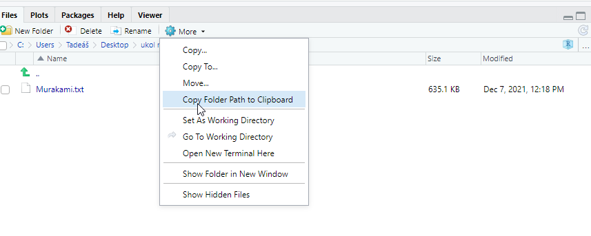

# *Nejlepšejší návod na vstup do Matrixu*  
  
Připrav si ručník, nepanikař, poděkuj rybám a jdem na to!  
  
## Příprava Rka  
  
Nejdřív je důležitý se na zákrok připravit, proto si nainstaluj tyhle zcela balíčky skrze příkaz: install.packages("balíček")  
  
"SnowballC" -> klíčový pro "text stemming"   
"wordcloud" -> to je docela očividný, viď! vono to nebude tak těžký nakonec.   
"RColorBrewer" -> pro všechny visual driven jedince klíčovej balíček aneb vymaluj si svůj mráček 
"stopwords" -> databáze stop slov v různejch jazycích + dobrých stop slov pro stemming  
"quanteda" -> balíček, který využijeme pro odstranění bezvýznamnových slov - proč?: https://stackoverflow.com/questions/26899857/self-conflicting-stopwords-in-r-tm-text-mining + další skvělá dokumentace zde: https://quanteda.io/articles/pkgdown/quickstart.html#creating-a-corpus
"readtext" -> čtení slov z .txt  
"quanteda.textplots" -> rozšíření quantedy pro tvorbu wordcloudů  
"quanteda.textstats" -> rozšíření quantedy pro tvorbu grafů z textu  
"ggplot2" -> snad ani nemusím představovat:-)  
  
Po instalaci všechny balíčky zapni skrz příkaz: library("balíček"). Pro milovníky oken se dají balíčky hledat a zapínat vpravo dole: https://i.imgur.com/8Z3MsGA.png 
  
```{r}
library("quanteda")
library("readtext")
library("stopwords")
library("SnowballC")
library("wordcloud")
library("RColorBrewer")
library("quanteda.textplots")
library("quanteda.textstats")
library("ggplot2")
```
  
## Příprava textu k mráčkování
  
Teď je ten moment, kdy chcem zjistit, co chceme zpracovávat. Já třeba žiju rád nebezpečně, takže jsem šel na infamous stránku Library Genesis (https://libgen.is/). Rozhodl jsem se zpracovat knihu z mého oblíbeného žánru magickýho realismu - Konec světa&Hardboiled Wonderland od Murakamiho.  
  
Většina knih je na Libgenu ve formátu .epub. Já zvolil nejjednodušší cestu a jako vstup do celého procesu textového těžení jsem si zvolil .txt. Konverze je poměrně jednoduchá, využít se dá například tato služba: https://convertio.co/epub-txt/. Netřeba za tím hledat nástrahy, jde o přímočarý proces.   
  
## Konečně kódujem, hurá
  
Textovej soubor s knížkou teda máme. Ten chceme naloadovat. Tady už zjistíme, že se můj kód mění od referečního, který používá knihovnu textmining (tm). Po intenzivním googlení jsem usoudil, že nejlepším nástrojem na kvantitativní textovou analýzu je quanteda. Ta má trochu jiné nástroje než tm, ale zas mi to pomohlo pochopit fungování Rka o něco lépe.  

Nejdřív načteme slova z našeho textového souboru do datasetu:  
  
```{r}
KonecSvěta <- readtext("~/GitHub/RStudio/data murakami/Murakami.txt")
```
  
Pokud nevíš, jak jednoduše vykopírovat cestu k souboru, tak je to tady:     
  
Teď budeme potřebovat Corpus. Výhoda quantedy je třeba v tom, že data v Corpusu při čištění nemění - využívá místo toho tokeny. Token se vytvoří takto:

```{r}
KorpusWonderland <- corpus(KonecSveta)
summary(KorpusWonderland)
```

Je vidět, že Corpus je teď zmatenej, potřebujeme mu říct, co v textu je, z čeho má tokeny vytvářet - obecně v Rku používáme vektory, který nám říkaj, co daná věc znamená - mohou to být čísla, data, jména, roky! V tomhle případě nám ale bude stačit jednoduchý charakterový vektor. - to je první část kódu  

V druhé části si připravíme Tokeny, které potom můžeme dále čistit.  

```{r}
as.character(KorpusWonderland)[2]
summary(KorpusWonderland, n = 1)
```
Nyní připravíme tokeny v samotném korpusu. Jde použít jen neinvazivní příkazy - použil jsem naprostou většinu z nich, více v dokumentaci o quantedě.  

```{r}
tokens(KorpusWonderland, remove_numbers = TRUE, remove_punct = TRUE, remove_symbols = TRUE, remove_url = TRUE, remove_separators = TRUE)
```
Teď si vytvořím separátní set tokenů - v tom je zase quanteda lepší než tm - TM zasahuje při čištění přímo do korpusu, kdežto v quantedě předcházíme případné ztrátě dat a progresu již takto. Následujícím příkazem vytváříme data set Tokeny, který obsahuje tokeny z našeho korpusu.  

```{r}
Tokeny <- tokens(KorpusWonderland, remove_numbers = TRUE, remove_punct = TRUE, remove_symbols = TRUE, remove_url = TRUE, remove_separators = TRUE)
```

V dalším kroku chci, aby bylo všechno v lowercase, na to je tento příkaz (tady používám dokumentaci, nic složitého)  

```{r}
MaleTokeny <- tokens_tolower(Tokeny, keep_acronyms = FALSE)
```

No a ted prichazi zajimavejsi cast. Chci se zbavit bezvyznamovych slow (a, the,...). Na to vyuziju balicek stopwords. Opět, balíček tm využívat externí stopwords neumí, už ten příkaz v sobě má a je dost na prd. V quantedě můžeme využít snowball stopwords databázi.

příkaz je následující - vyberu z malých tokenů ty, které odpovídají databázi stopwords od snowball a pak řeknu, že jejich označení znamená, že je odstraním  

```{r}
CisteTokeny <- tokens_select(MaleTokeny, pattern = stopwords(language = "en", source = "snowball", simplify = TRUE), selection = "remove")
print(CisteTokeny)
```
Dostala ses až sem? Tak trocha egoboostu, tohle píšou v dokumentaci ke quantedě "Tokenizing texts is an intermediate option, and most users will want to skip straight to constructing a document-feature matrix"  

Pokračujeme ale dál. Nyní si chci vybrat další slova, která se mi v CisteTokeny nelíbí. To udělám skrze arguemnt pattern:  

```{r}
ManualniNiceni <- tokens_select(CisteTokeny, pattern = c("said", "like", "one", "say", "can", "go", "right"), selection = "remove")
```

## Matrix?

Teď mám tedy vyčištěné tokeny a připravený korpus, vzhůru do Matrixu!  
  
Na to je příkaz následující, pak si jen vytisknem pár znaků, abychom se ujistili, že to je správně:  

```{r}
MatrixWonderland <- tokens(ManualniNiceni) %>%
  dfm()
MatrixWonderland[, 1:30]
```
Šikovnou funkcí je wordstem - stemming - odstraníme přebytečná písmenka a získáme tím jen kořeny slov:  

```{r}
MatrixWonderland <- dfm_wordstem(MatrixWonderland, language = ("english"))
```

Teď se podíváme na naše top slova:  

```{r}
topfeatures(MatrixWonderland, 80)
```
## Vizualizace: mráčky a grafíky

Tak! A je to tady, teď už jdeme dělat mráček.
Nastavíme si seed, aby se nám generoval stále stejně, když ho budeme chtít upravovat. Argumenty jsou docela jasné, v dokumentaci dobře popsané. Využíváme tu na barvení knihovnu RColorBrewer. Abych neměl stejný graf jako všichni, tak jsem využil sekvenční paletu s co nejvyšším množstvím odlišení, v tomto případě je barev 9.  

```{r}
set.seed(100)
textplot_wordcloud(MatrixWonderland, min_count = 100, random_order = FALSE, rotation = 0.25, color = RColorBrewer::brewer.pal(9, "YlGnBu"))
```

Pak jsem chtěl udělat ještě grafík. Dokumentace tady: https://quanteda.io/articles/pkgdown/examples/plotting.html 
Jestli ses dostal/a až sem, tak už to vůbec není těžké pochopit:-)  

```{r}
FrequencyPlot <- textstat_frequency(MatrixWonderland, n = 100)
FrequencyPlot$feature <- with(FrequencyPlot, reorder(feature, -frequency))
```

```{r}
ggplot(FrequencyPlot, aes(x = feature, y = frequency)) +
  geom_point() +
  theme(axis.text.x = element_text(angle = 90, hjust = 1))
```


# Odkazy na zdroje

Neseřazeno, jak jsem to pomíchal, tak to sem posílám  
  
https://quanteda.io/articles/pkgdown/examples/plotting.html  
https://stackoverflow.com/questions/47039236/how-to-keep-wordcloud-layout-in-r  
https://stackoverflow.com/questions/26899857/self-conflicting-stopwords-in-r-tm-text-mining -> proto quanteda, tm sucks!  
https://quanteda.io/articles/pkgdown/comparison.html -> proto quanteda, je prostě dobrá! na kvantitativní analýzu textu není nic lepšího  
https://quanteda.io/reference/tokens.html -> Jak používat tokeny  
https://tutorials.quanteda.io/basic-operations/tokens/tokens_select/ -> jak vybrat a odstranit tokeny, který nechcem     
https://quanteda.io/reference/stopwords.html -> stopwords   
  
https://quanteda.io/reference/tokens_tolower.html -> jak hodit vše do lowercase  
  
https://quanteda.io/articles/quickstart.html -> základní návod na to, jak nahrát .txt, jak ho přečíst, jak ho převést do corpusu, jak pracovat s tokenama a jak udělat wordcloud případně vizualizovat ggplotem  
  
https://quanteda.io/articles/pkgdown/examples/plotting.html -> širší možnosti vizualizace  
  
https://quanteda.io/reference/textplot_wordcloud.html -> values pro wordcloud v quantedě  

https://www.datanovia.com/en/blog/the-a-z-of-rcolorbrewer-palette/#display-all-brewer-palettes -> rcolorbrewer palety

https://quanteda.io/articles/pkgdown/replication/digital-humanities.html -> digital humanities porno! nástroje, který nám ukazoval Josef jsou skvělý v tom, jak jsou jednoduchý, ale tohle toho umí tolik! TOLIK!

Palety textově:
Sequential palettes (first list of colors), which are suited to ordered data that progress from low to high (gradient). The palettes names are : Blues, BuGn, BuPu, GnBu, Greens, Greys, Oranges, OrRd, PuBu, PuBuGn, PuRd, Purples, RdPu, Reds, YlGn, YlGnBu YlOrBr, YlOrRd.  
Qualitative palettes (second list of colors), which are best suited to represent nominal or categorical data. They not imply magnitude differences between groups. The palettes names are : Accent, Dark2, Paired, Pastel1, Pastel2, Set1, Set2, Set3.  
Diverging palettes (third list of colors), which put equal emphasis on mid-range critical values and extremes at both ends of the data range. The diverging palettes are : BrBG, PiYG, PRGn, PuOr, RdBu, RdGy, RdYlBu, RdYlGn, Spectral  


## Tipy na konec

instalace externích repositories se provádí skrz balíček "remotes"
